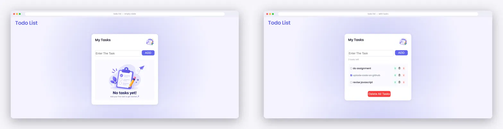

# 📝 Todo List

A simple, clean, and responsive **Todo List Web App** built using **HTML, CSS, and JavaScript**.

The project provides an easy way to add, complete, reorder, and delete tasks. Tasks are also saved in the browser using **localStorage**, so they remain available after refreshing the page.

## ✨ Features

* ➕ Add new tasks
* ⌨️ Add tasks using the **Enter** key
* ✅ Mark tasks as completed
* ↩️ Move tasks **up**
* ↪️ Move tasks **down**
* 🗑️ Delete individual tasks
* 🧹 Delete all tasks
* 🔢 Automatic task counter
* 💾 Tasks saved using `localStorage`
* 🔄 Tasks restored automatically after refreshing
* 📝 Empty-state illustration when there are no tasks
* 📱 Responsive design for smaller screens
* 🎨 Purple and lavender modern UI

## 🛠️ Technologies Used

* HTML5
* CSS3
* JavaScript
* DOM Manipulation
* Browser `localStorage`
* Google Fonts — Poppins
* Font Awesome

## 📂 Project Structure

```text
todo-list/
│
├── index.html
├── style.css
├── script.js
│
├── image1.png
├── image2.png
├── image3.png
│
└── README.md
```

### Image Files

| File         | Purpose                                    |
| ------------ | ------------------------------------------ |
| `image1.png` | Illustration beside the "My Tasks" heading |
| `image2.png` | Empty-task illustration                    |
| `image3.png` | Delete-task icon                           |


## 🎯 How to Use

### Add a Task

Type a task into the input field and click **ADD**.

You can also press **Enter** after typing the task.

### Complete a Task

Click the checkbox next to a task.

The task text will receive a line-through effect.

### Move Tasks

Use the arrow buttons to change the order of your tasks.

* ⬆️ Move a task upward
* ⬇️ Move a task downward

### Delete a Task

Click the delete icon beside a task to remove it.

### Delete All Tasks

Click **Delete All Tasks** to remove every task from the list.

## 💾 Local Storage

This project uses the browser's `localStorage` to save the task list.

When tasks are added, deleted, completed, or reordered, the current task list is saved.

When the page is opened again, the saved tasks are loaded automatically.

This means you can refresh the browser without losing your tasks.

## 🎨 Design

The application uses a soft purple/lavender color palette.

### Main Colors

```text
Background:       #F4F3FF
Primary Purple:   #6366F1
Hover Purple:     #818CF8
Text:             #1E1B2E
Light Gray:       #9CA3AF
Green:            #10B981
Red:              #EF4444
```

The interface uses **Poppins** for a clean and modern appearance.

## 📱 Responsive Design

The layout includes a mobile breakpoint for screens smaller than `550px`.

The main task card and empty-state illustration are adjusted for smaller screens.

## 📸 Preview



## 🔮 Future Improvements

Possible features for future versions:

* 🔍 Search tasks
* 🏷️ Task categories
* ⭐ Task priority
* 📅 Due dates
* 🌙 Dark mode
* 🔔 Reminders
* 📊 Active/completed filters
* 📆 Calendar integration
* ✏️ Edit existing tasks
* 🎯 Drag-and-drop task ordering

## 🤝 Contributing

Contributions, suggestions, and improvements are welcome.

1. Fork the repository
2. Create a new branch
3. Make your changes
4. Commit your changes
5. Push the branch
6. Create a Pull Request

## 📄 License

This project is open source and available for personal and educational use.

---

## 👨‍💻 Author

**Naman Sharma**

GitHub: https://github.com/namansharma0810

If you like this project, consider giving the repository a ⭐ on GitHub!
